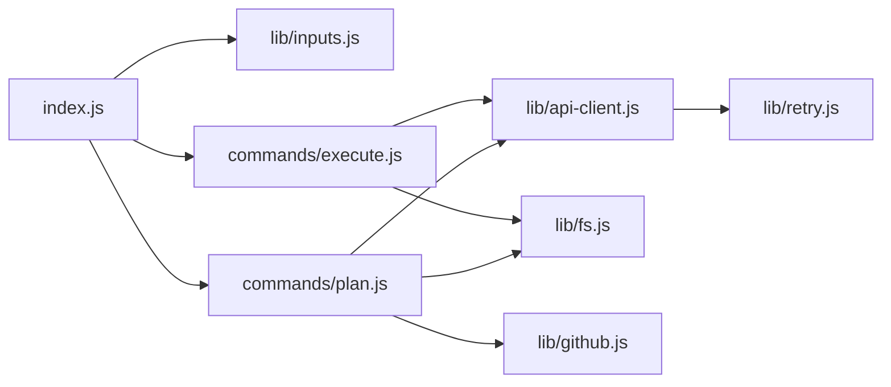

# Developer guide — Entity Sync Action

This document is for maintainers of the public `synatic/entity-sync-action` repository.

## Architecture



| Module                    | Responsibility                              |
| ------------------------- | ------------------------------------------- |
| `src/index.js`            | Entry point; dispatches by `command` input  |
| `src/lib/inputs.js`       | Input parsing and validation                |
| `src/lib/api-client.js`   | Synatic entity-sync REST client             |
| `src/lib/retry.js`        | HTTP 429 exponential backoff for `got`      |
| `src/lib/fs.js`           | Read/write plan JSON and manifest           |
| `src/lib/github.js`       | Auto-commit plan files via GitHub Git API   |
| `src/commands/plan.js`    | Plan → write files → optional Git commit/PR |
| `src/commands/execute.js` | Read plan → preview → execute → run audit   |

## Local development

```bash
npm ci
npm test
npm run build
```

The action entry point is `src/index.js`. It runs automatically when loaded unless `NODE_ENV=test`.

For local debugging, set GitHub Actions environment variables manually:

```bash
export INPUT_COMMAND=execute
export INPUT_API_URL=https://api.example.com
export INPUT_API_KEY=syn_api_...
export INPUT_DEST_ORG=acme-prod
export INPUT_PLAN_PATH=.synatic/plans/plan.json
export GITHUB_WORKSPACE=$PWD
npm run build && node dist/index.js
```

## Why we bundle with ncc

JavaScript actions declare:

```yaml
runs:
  using: node24
  main: dist/index.js
```

When a customer runs `uses: synatic/entity-sync-action@v1`, GitHub checks out the action repo at that tag and executes `dist/index.js`. It does **not** run `npm install` in the action repository.

Dependencies (`@actions/core`, `got`, `octokit`, etc.) must therefore be bundled into `dist/` at build time:

```bash
ncc build src/index.js -o dist
```

CI on `main` rebuilds and commits `dist/` so the latest bundle is on `main` before you cut a release with `npm version`.

Alternatives considered:

- **Commit `node_modules/`** — bloated and hard to review
- **esbuild** — faster; fine alternative if ncc becomes problematic
- **Docker action** — unnecessary for this use case

## Release process

This repository is **public on GitHub** but is **not published to the npm registry**. `"private": false` in `package.json` only reflects that the repo is public; consumers install the action via Git tags, not `npm install`.

Customers pin the action with a **Git tag**:

```yaml
uses: synatic/entity-sync-action@v1.0.3 # resolves to a git ref
```

Use **`npm version`** to bump `package.json`, create the matching git tag, and keep version metadata in sync. That tag is what GitHub Actions consumers reference.

### Release workflow

1. Merge changes to `main`.
2. CI runs tests, builds with ncc, and commits `dist/` if it changed.
3. Pull `main` locally and confirm `dist/` is up to date.
4. Bump the version and create a release tag:

```bash
npm version patch   # or minor / major
git push && git push --tags
```

`npm version` updates `package.json` (and `package-lock.json`), creates a commit, and tags it (e.g. `v1.0.1`).

5. Create a GitHub release from the tag (optional but recommended):

```bash
gh release create v1.0.1 --generate-notes
```

6. Update the moving major tag so `@v1` consumers get the latest compatible release:

```bash
git tag -f v1 v1.0.1
git push -f origin v1
```

`npm version` does not maintain floating major tags — step 6 is still required for `@v1` pinning.

### Version pinning

| Pin   | Example   | Behavior                                                       |
| ----- | --------- | -------------------------------------------------------------- |
| Exact | `@v1.0.3` | Always runs that tagged commit                                 |
| Major | `@v1`     | Runs the commit pointed to by the `v1` tag (updated in step 6) |

### Breaking changes

Use `npm version major` when making incompatible changes (e.g. Node runtime bumps after `v1` is live). Update the major tag only when you want `@v1` (or `@v2`) to move forward.

## Publishing checklist (GitHub portal)

1. **Repository visibility** — set to **Public** (required for a public action).
2. **Actions settings** — Settings → Actions → General:
   - Allow GitHub Actions
   - Workflow permissions: read and write (needed for CI to commit `dist/`)
3. **First release** — ensure `action.yml` and `dist/index.js` exist on the tagged commit.
4. **Verify consumption** — test in a separate repo:

   ```yaml
   uses: synatic/entity-sync-action@v1.0.1
   ```

5. **Optional: GitHub Marketplace**
   - Release page → Publish to Marketplace (or Actions tab → Publish)
   - Add description, icon, category
   - Link to README for usage docs

6. **Branch protection** — protect `main`; require CI to pass before merge.

## CI workflow

[`.github/workflows/ci.yml`](.github/workflows/ci.yml):

- **Pull requests** — lint, test, build (does not push `dist/`)
- **Push to main** — lint, test, build, commit `dist/` if changed

No private NPM registry token is required (unlike the legacy actions that depended on `@synatic/sync`).

## Testing

Unit tests live in `test/` and use Vitest:

- Input validation
- API client request/error handling (mocked HTTP)
- Plan file read/write
- Execute conflict gating

Integration testing against a real Synatic API is manual: run a workflow dispatch in a test repo with secrets configured.

## Security notes for maintainers

- Never log `api-key` input values.
- Do not commit secrets or real plan files from customer environments.
- Review plan auto-commit PRs carefully in customer repos — plans may contain sensitive configuration.

## Migrating from legacy actions

The old `gh-action-pull` / `gh-action-push` pair used legacy `/v1/sync/:orgId` endpoints and full-org mirroring. This action uses the entity-sync API (`/entity-sync/plan`, `/preview`, `/execute`) with a single root entity and dependency closure. Do not port legacy push/pull entity logic — only GitHub packaging patterns were reused.
